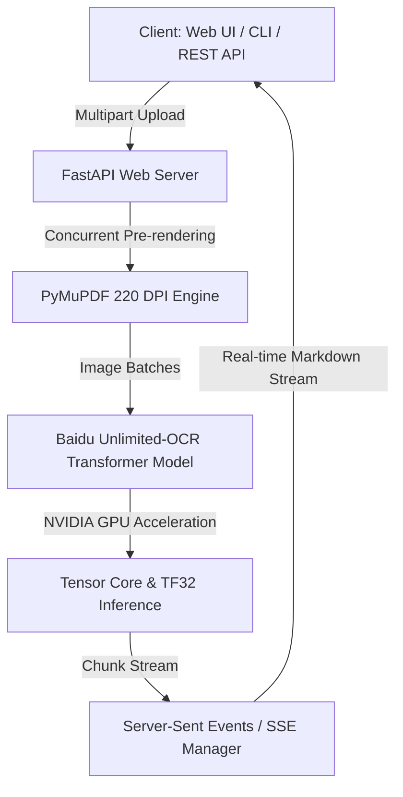

<div align="center">

# 🚀 chinhan_OCR: Real-Time Streaming Document & OCR System

<p align="center">
  <b>Hệ thống trích xuất văn bản & tài liệu PDF siêu tốc độ thời gian thực dựa trên Baidu Unlimited-OCR và NVIDIA GPU Acceleration.</b>
</p>

[](https://www.python.org/)
[](https://pytorch.org/)
[](https://fastapi.tiangolo.com/)
[](https://www.docker.com/)
[](https://developer.nvidia.com/cuda-zone)
[](LICENSE)

</div>

---

## 📖 Hướng Dẫn Cài Đặt & Sử Dụng Cho Máy Mới (Fresh Machine Setup)

Nếu bạn vừa `git clone` dự án này về một máy chủ/máy tính mới, hãy làm theo đúng **4 bước đơn giản** dưới đây để đưa hệ thống vào hoạt động:

### ⚙️ Điều Kiện Cần (Prerequisites)
* **Hệ điều hành**: Linux (Khuyên dùng Ubuntu 20.04 / 22.04 / 24.04 LTS).
* **Card đồ họa**: Card rời NVIDIA có VRAM ≥ 8GB (Đã cài driver NVIDIA, gõ `nvidia-smi` thấy nhận card).

---

### 🛠️ BƯỚC 1: Tải Mã Nguồn

Mở Terminal trên máy mới và chạy lệnh:
```bash
git clone https://github.com/chinhanxt/chinhan_OCR.git
cd chinhan_OCR
```

---

### 🛠️ BƯỚC 2: Cài Đặt Môi Trường Docker & GPU Driver (Nếu máy chưa có)

Nếu máy tính mới của bạn **chưa cài Docker** hoặc **chưa nhận GPU trong Docker**, hãy copy toàn bộ lệnh dưới đây và dán vào Terminal để cài tự động:

```bash
# 1. Cài đặt Docker & Docker Compose
sudo apt update && sudo apt install -y docker.io docker-compose-v2
sudo usermod -aG docker $USER

# 2. Cài đặt NVIDIA Container Toolkit (Giúp Docker nhận Card GPU)
curl -fsSL https://nvidia.github.io/libnvidia-container/gpgkey | sudo gpg --dearmor -o /usr/share/keyrings/nvidia-container-toolkit-keyring.gpg
curl -s -L https://nvidia.github.io/libnvidia-container/experimental/deb/nvidia-container-toolkit.list | \
  sed 's#deb https://#deb [signed-by=/usr/share/keyrings/nvidia-container-toolkit-keyring.gpg] https://#g' | \
  sudo tee /etc/apt/sources.list.d/nvidia-container-toolkit.list

sudo apt update && sudo apt install -y nvidia-container-toolkit
sudo systemctl restart docker
```

---

### 🛠️ BƯỚC 3: Khởi Chạy Ứng Dụng (1-Click Start)

Chạy lệnh Docker Compose để dựng container và tải mô hình AI tự động:

```bash
docker compose up -d
```

> 📌 **Lưu ý ở lần chạy đầu tiên**:
> Container sẽ tự động build môi trường và tải mô hình AI **Baidu Unlimited-OCR** từ Hugging Face. Quá trình này mất khoảng **2 - 5 phút** tùy thuộc vào tốc độ mạng.

---

### 🛠️ BƯỚC 4: Kiểm Tra Trạng Thái Hoạt Động

Theo dõi nhật ký khởi động của container bằng lệnh:
```bash
docker logs -f unlimited_ocr_unsloth_container
```

Khi Terminal xuất hiện dòng chữ sau là hệ thống đã sẵn sàng 100%:
```text
[INFO] Model loaded on GPU: NVIDIA GeForce RTX ...
INFO: Application startup complete.
INFO: Uvicorn running on http://0.0.0.0:8000
```
*(Bấm `Ctrl + C` để thoát khỏi màn hình xem log)*.

---

## 🖥️ HƯỚNG DẪN SỬ DỤNG HỆ THỐNG

### 🎯 Cách 1: Sử Dụng Giao Diện Web UI (Dễ Nhất)

1. Mở trình duyệt web (Chrome, Edge, Firefox...).
2. Truy cập theo đường dẫn:
   * **Nếu mở trên cùng máy**: `http://localhost:3000/`
   * **Nếu mở từ máy khác trong mạng LAN**: `http://<IP_MÁY_CHỦ>:3000/` *(Ví dụ: `http://192.168.1.50:3000/`)*
3. **Cách dùng**: Kéo thả tệp PDF hoặc ảnh tài liệu vào ô tải lên. Kết quả OCR và bảng biểu sẽ hiển thị thời gian thực theo từng trang!

> 💡 **Truy cập từ xa qua SSH (SSH Tunneling)**:
> Nếu bạn truy cập máy chủ qua SSH từ máy tính cá nhân, hãy chạy lệnh forward port ở Terminal máy cá nhân:
> ```bash
> ssh -L 3000:localhost:3000 user@<IP_MÁY_CHỦ>
> ```
> Sau đó mở trình duyệt máy cá nhân tại: `http://localhost:3000/`

---

### 💻 Cách 2: Sử Dụng Công Cụ Dòng Lệnh Terminal (CLI Tool)

Bạn có thể trích xuất nhanh tài liệu ngay trong Terminal mà không cần mở trình duyệt:

1. Cài đặt thư viện hỗ trợ (chỉ cần chạy 1 lần):
   ```bash
   pip install requests pymupdf pillow
   ```
2. **Trích xuất 1 tệp Ảnh hoặc PDF bất kỳ**:
   ```bash
   python3 scripts/ocr_cli.py /path/to/document.pdf -o output.txt
   ```
3. **Trích xuất từ Ảnh Chụp Màn Hình (Clipboard)**:
   Chụp màn hình bất kỳ (`PrintScreen` / `Ctrl+Shift+PrintScreen`), sau đó gõ:
   ```bash
   python3 scripts/ocr_cli.py
   ```

---

### 📡 Cách 3: Tích Hợp API Vào Code Dự Án Của Bạn

#### **Ví dụ bằng cURL (Terminal)**:
```bash
curl -X 'POST' \
  'http://localhost:3000/v1/ocr?mode=gundam' \
  -H 'accept: application/json' \
  -H 'Content-Type: multipart/form-data' \
  -F 'file=@/path/to/your_file.pdf'
```

#### **Ví dụ bằng Python**:
```python
import requests

url = "http://localhost:3000/v1/ocr"
files = {"file": open("tai_lieu.pdf", "rb")}
params = {"mode": "gundam"}

response = requests.post(url, files=files, params=params)
result = response.json()

print("📝 Kết quả Markdown:")
print(result["clean_markdown"])
```

---

## ✨ Các Tính Năng Nổi Bật (Key Features)

* **⚡ Real-Time SSE Streaming (`POST /v1/ocr/stream`)**: Giảm thời gian chờ trang đầu tiên xuống **~3 giây**.
* **🎨 Stitch Design Blueprint Web UI**: Giao diện Neon Blueprint lung linh, xem trước PDF/Ảnh gốc song song với kết quả Markdown.
* **🔘 Page Navigation Tabs**: Tự động chia trang và tạo tab lọc nhanh (`[📄 Xem Tất Cả]`, `[Trang 1]`, `[Trang 2]`...).
* **📊 Nhận Dạng Bảng Biểu Kinh Phí (220 DPI)**: Tự động chuyển đổi bảng số liệu thành Markdown Table (`| STT | Nội dung | Số lượng |`).

---

## 🏗️ Kiến Trúc Hệ Thống (Architecture)



---

## 📂 Cấu Trúc Thư Mục Dự Án (Directory Layout)

```
chinhan_OCR/
├── 📁 assets/                 # Hình ảnh logo, tài liệu minh họa & GIF demo
├── 📁 scripts/                # Công cụ CLI & script kiểm thử
│   ├── ocr_cli.py             # Terminal CLI Tool hỗ trợ Clipboard
│   ├── test_api.py            # Script test REST API
│   └── test_stream_endpoint.py # Script test SSE Stream Endpoint
├── 📁 src/                    # Mã nguồn Python các module (Core Engine, API, Web UI)
│   ├── config.py              # Cấu hình GPU & môi trường
│   ├── api/                   # FastAPI Endpoints
│   ├── core/                  # Engine suy luận Model & PDF Pre-render
│   └── web/                   # Web Studio Template Engine
├── 📄 app.py                  # Server ứng dụng FastAPI
├── 📄 Dockerfile              # Cấu hình môi trường Docker
├── 📄 docker-compose.yml      # Cấu hình Docker Compose GPU
├── 📄 requirements.txt        # Danh sách thư viện Python
└── 📄 README.md               # Hướng dẫn sử dụng
```

---

## 📜 Giấy Phép & Ghi Nhận (License & Acknowledgments)

Dự án được phát triển và tối ưu dựa trên mô hình học máy **[Baidu Unlimited-OCR](https://github.com/baidu/Unlimited-OCR)**.
Mã nguồn wrapper API, tối ưu tăng tốc GPU và giao diện Web UI thuộc bản quyền dự án **chinhan_OCR**.

<div align="center">
  <b>Made with ❤️ for High-Performance AI Document Processing</b>
</div>
