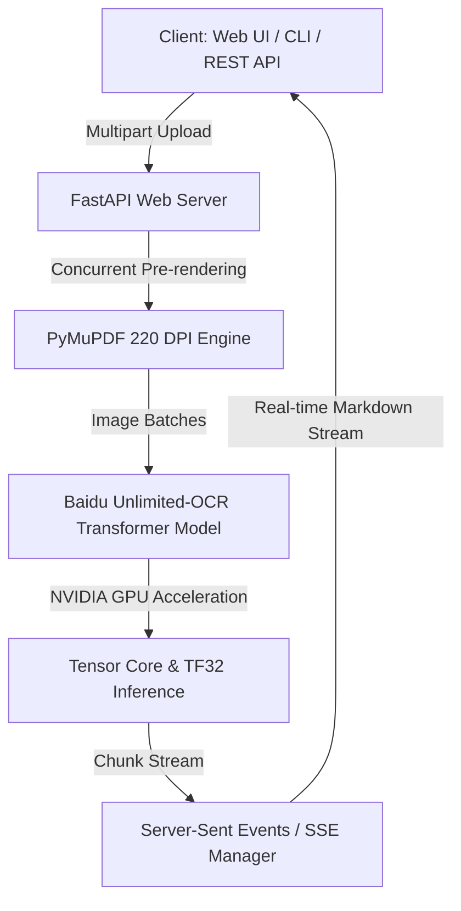

<div align="center">

# 🚀 chinhan_OCR: Real-Time Streaming Document & OCR System

<p align="center">
  <b>Hệ thống trích xuất văn bản & tài liệu PDF siêu tốc độ thời gian thực dựa trên Baidu Unlimited-OCR và NVIDIA GPU Acceleration.</b>
</p>

[](https://www.python.org/)
[](https://pytorch.org/)
[](https://fastapi.tiangolo.com/)
[](https://www.docker.com/)
[](https://developer.nvidia.com/cuda-zone)
[](LICENSE)

</div>

---

## 🌟 Giới Thiệu (Overview)

**chinhan_OCR** là hệ thống xử lý & trích xuất văn bản tài liệu đa trang (PDF, Images) thế hệ mới. Được xây dựng trên nền tảng mô hình AI **Baidu Unlimited-OCR**, hệ thống cho phép trích xuất tài liệu phức tạp, bảng biểu kinh phí, hợp đồng, báo cáo tài chính với độ chính xác tuyệt đối và tốc độ phản hồi tính bằng miligiây nhờ công nghệ **Server-Sent Events (SSE)**.

---

## ✨ Tính Năng Nổi Bật (Key Features)

* **⚡ Real-Time SSE Streaming (`POST /v1/ocr/stream`)**:
  * Giảm thời gian chờ phản hồi trang đầu tiên (Time-to-First-Byte) xuống **~3 giây**.
  * Server vừa nhận dạng xong trang nào sẽ lập tức stream nội dung trang đó về giao diện client thời gian thực.
* **🎨 Stitch Design Blueprint Web UI**:
  * Giao diện người dùng sang trọng, hiện đại với hiệu ứng khung viền Neon Blueprint (`@keyframes stitchBorderDraw`), tia quét Laser Scan và dòng văn bản tuôn trào mượt mà.
  * Tích hợp công cụ xem trước PDF/Ảnh gốc trực quan song song với kết quả Markdown.
* **🔘 Interactive Page Navigation Tabs**:
  * Tự động phân tách trang và tạo các tab chuyển nhanh (`[📄 Xem Tất Cả]`, `[Trang 1]`, `[Trang 2]`...). Bấm chuyển trang tức thì mà không cần load lại dữ liệu.
* **📊 Bảo Toàn Cấu Trúc Bảng Biểu & Kinh Phí (220 DPI)**:
  * Xử lý PDF ở độ phân giải 220 DPI sắc nét. Thuật toán tự động định dạng dòng kinh phí và bảng số liệu thành chuẩn **Markdown Table** (`| STT | Nội dung | Đơn giá | Thành tiền |`).
* **📋 Smart Terminal CLI (`ocr_cli.py`)**:
  * Hỗ trợ trích xuất nhanh từ dòng lệnh hoặc **tự động bắt ảnh từ Clipboard** (chụp màn hình là trích xuất ngay).

---

## 🏗️ Kiến Trúc Hệ Thống (Architecture)



---

## ⚡ 4 Giải Pháp Tối Ưu Tốc Độ GPU

1. **CPU Parallel Pre-rendering (`ThreadPoolExecutor`)**: Pre-render toàn bộ các trang PDF song song ở RAM-disk tốc độ cao trong `<0.2s`.
2. **Tensor Core TF32 Acceleration**: Kích hoạt `torch.set_float32_matmul_precision('high')` & `allow_tf32` tối ưu cho dòng card NVIDIA RTX.
3. **`torch.inference_mode()`**: Triệt tiêu hoàn toàn chi phí theo dõi bộ nhớ Autograd Tracking trong quá trình suy luận Transformer.
4. **Dynamic Stream Ticker (10ms)**: Tốc độ đẩy dòng văn bản lên giao diện vô cùng mượt mà, phản hồi tức thì.

---

## 🛠️ Yêu Cầu Hệ Thống (Requirements)

| Thành phần | Yêu cầu tối thiểu | Khuyên dùng |
| :--- | :--- | :--- |
| **OS** | Linux (Ubuntu 20.04+) | Ubuntu 22.04 LTS / 24.04 LTS |
| **GPU** | NVIDIA GPU (VRAM ≥ 8GB) | NVIDIA RTX 3060 / 4060 / 5060 Ti trở lên |
| **NVIDIA Driver** | ≥ 535.xx | Latest Production Branch |
| **Môi trường** | Docker Engine & Docker Compose | NVIDIA Container Toolkit đã cài đặt |

---

## 🚀 Cài Đặt & Khởi Chạy Nhanh (Quickstart)

### 1. Tải Mã Nguồn

```bash
git clone https://github.com/chinhanxt/chinhan_OCR.git
cd chinhan_OCR
```

### 2. Khởi Chạy Bằng Docker Compose (Khuyên dùng)

```bash
docker compose up -d
```

### 3. Theo Dõi Nhật Ký Khởi Động

```bash
docker logs -f unlimited_ocr_unsloth_container
```
*Chờ thông báo `Model loaded on GPU: NVIDIA GeForce RTX ...` và `Uvicorn running on http://0.0.0.0:8000` là hệ thống đã sẵn sàng!*

---

## 🌐 Trải Nghiệm Giao Diện Web UI

Sau khi container khởi chạy thành công:

* **Mở trực tiếp trên máy chủ / Mạng nội bộ (LAN)**:
  👉 **`http://<SERVER_IP>:3000/`** *(Ví dụ: `http://192.168.92.139:3000/`)*
* **Tài liệu API Swagger**:
  👉 **`http://<SERVER_IP>:3000/docs`**

> 💡 **Mẹo (SSH Remote Tunneling)**: Nếu bạn dùng SSH từ xa kết nối vào server, hãy forward port 3000 bằng lệnh sau ở máy cá nhân:
> ```bash
> ssh -L 3000:localhost:3000 user@<SERVER_IP>
> ```
> Sau đó mở trình duyệt tại: **`http://localhost:3000/`**

---

## 💻 Sử Dụng Terminal CLI Tool (`ocr_cli.py`)

Công cụ dòng lệnh nhỏ gọn cho phép trích xuất nhanh tài liệu:

### 1. Trích xuất file Ảnh / PDF bất kỳ:
```bash
python3 ocr_cli.py /path/to/document.pdf -o output.txt
```

### 2. Trích xuất trực tiếp từ Ảnh Chụp Màn Hình (Clipboard):
Chỉ cần bấm phím chụp màn hình (`PrintScreen` / `Ctrl+Shift+PrintScreen`), sau đó gõ:
```bash
python3 ocr_cli.py
```
*Script sẽ tự động lấy ảnh trong Clipboard, gửi tới OCR Server và in kết quả ra màn hình!*

### 3. Tùy chọn Chế độ Xử Lý (`--mode`):
* `gundam` *(Mặc định)*: Crop chi tiết tỉ mỉ, tối ưu cho bảng biểu, văn bản phức tạp.
* `base`: Xử lý toàn trang ở kích thước chuẩn.

---

## 📡 Danh Sách API Endpoints

### 1. Real-Time SSE Stream OCR (`POST /v1/ocr/stream`)
Stream kết quả trực tiếp theo từng trang ngay khi nhận dạng xong.
* **URL**: `/v1/ocr/stream?mode=gundam`
* **Method**: `POST`
* **Header**: `Content-Type: multipart/form-data`
* **Body**: `file` (File PDF hoặc Ảnh)
* **Response**: `text/event-stream`

### 2. Standard JSON OCR (`POST /v1/ocr`)
Trả về toàn bộ kết quả dưới dạng JSON hoàn chỉnh sau khi xử lý xong tất cả các trang.
* **URL**: `/v1/ocr?mode=gundam`
* **Method**: `POST`
* **Response**:
```json
{
  "parsed_text": "# Tiêu đề tài liệu\n\n| STT | Nội dung | Số lượng |\n...",
  "clean_markdown": "# Tiêu đề tài liệu...",
  "page_count": 3,
  "elapsed_time": 4.12
}
```

### 3. Health & System Info
* `GET /health`: Kiểm tra sức khỏe hệ thống.
* `GET /api/info`: Xem thông số GPU và trạng thái mô hình.

---

## 📂 Cấu Trúc Thư Mục Dự Án (Directory Layout)

```
chinhan_OCR/
├── app.py                # FastAPI Server + Web UI Studio Engine
├── Dockerfile            # Container build spec (PyTorch CUDA + Transformers)
├── docker-compose.yml    # Cấu hình Docker Compose chia sẻ NVIDIA GPU
├── ocr_cli.py            # Terminal CLI Tool hỗ trợ Clipboard
├── requirements.txt      # Thư viện Python phụ thuộc
├── test_api.py           # Script kiểm thử REST API
├── test_stream_endpoint.py # Script kiểm thử SSE Stream Endpoint
└── README.md             # Tài liệu hướng dẫn sử dụng
```

---

## 📜 Giấy Phép & Ghi Nhận (License & Acknowledgments)

Dự án được xây dựng và tối ưu dựa trên mô hình học máy tiên tiến **[Baidu Unlimited-OCR](https://github.com/baidu/Unlimited-OCR)**. 
Mã nguồn wrapper API, tối ưu tăng tốc GPU và giao diện Web UI thuộc bản quyền của dự án **chinhan_OCR**.

<div align="center">
  <b>Made with ❤️ for High-Performance AI Document Processing</b>
</div>
