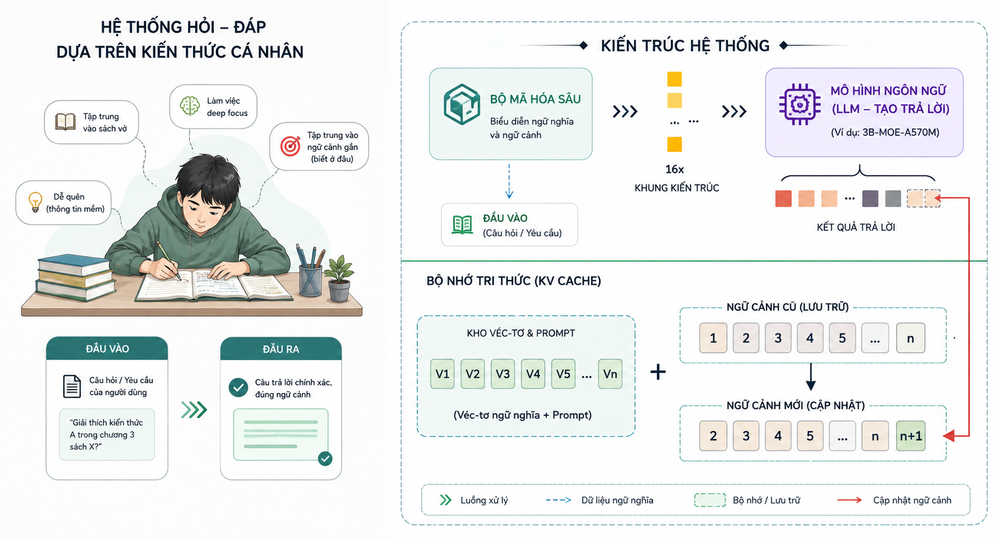
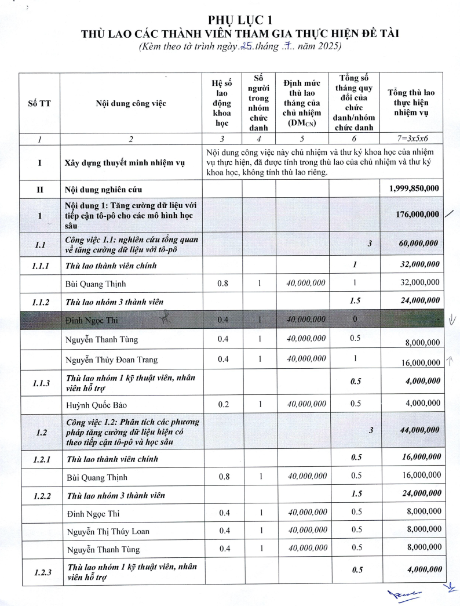
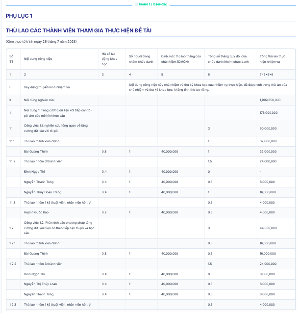
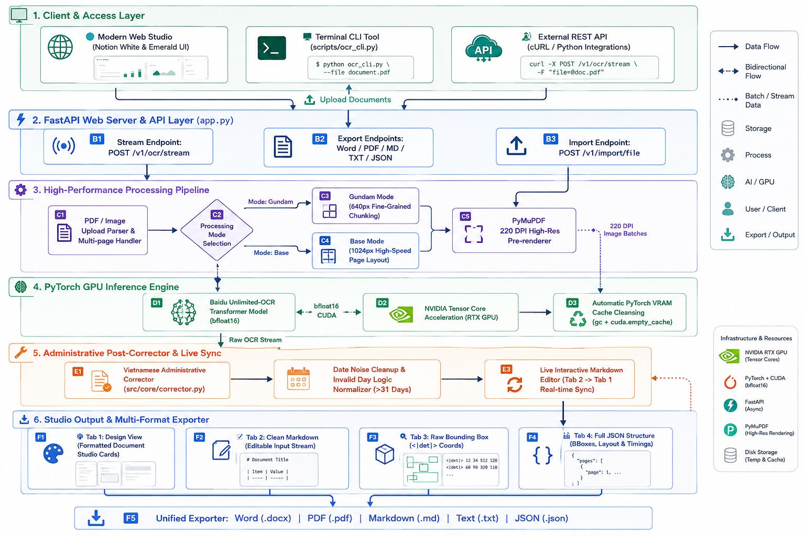

<div align="center">

# 🚀 chinhan_OCR: Real-Time Streaming Document & OCR System

<p align="center">
  <b>Hệ thống trích xuất văn bản & tài liệu PDF siêu tốc độ thời gian thực dựa trên Baidu Unlimited-OCR và NVIDIA GPU Acceleration.</b>
</p>

[](https://www.python.org/)
[](https://pytorch.org/)
[](https://fastapi.tiangolo.com/)
[](https://www.docker.com/)
[](https://developer.nvidia.com/cuda-zone)
[](LICENSE)

<br/>
<br/>



</div>

---

## 📸 Giao Diện Trực Quan (Demo Showcase)

<div align="center">

| 📄 **1. Tài Liệu Scan Gốc (Input Document)** | ⚡ **2. Kết Quả Bóc Tách trên Web Studio UI (OCR Output)** |
|:---:|:---:|
|  |  |
| *Bản scan văn bản & bảng biểu hành chính chứa chữ viết tay và nét mờ* | *Giao diện Web Studio: Trích xuất cấu trúc bảng biểu thời gian thực (`TRANG 3 / 16`)* |

</div>

---

## 🏗️ Kiến Trúc Hệ Thống (System Architecture)

<div align="center">



*Sơ đồ kiến trúc tổng quan hệ thống xử lý OCR & bóc tách văn bản real-time (Client Layer, FastAPI API Gateway, High-Performance Pipeline, PyTorch GPU Inference Engine, Administrative Post-Corrector & Exporter)*

</div>

---

## ✨ Các Tính Năng Nổi Bật (Key Features)

* **⚡ Real-Time SSE Streaming (`POST /v1/ocr/stream`)**: Giảm thời gian chờ trang đầu tiên xuống **~3 giây**.
* **🎨 Notion-Style Minimalist Single Toolbar**: Thanh công cụ gộp phẳng 1 dòng duy nhất, tối ưu 100% không gian hiển thị kết quả.
* **🔘 4 Tab Xem Kết Quả Chi Tiết**:
  * **Design**: Giao diện thẻ trình bày kết quả dạng bài viết đẹp mắt.
  * **Markdown**: Văn bản Markdown sạch có thể **chỉnh sửa trực tiếp (Editable)**.
  * **Raw**: Chứa mã OCR gốc và thẻ tọa độ Bounding Box `<|det|>`.
  * **JSON**: Cấu trúc dữ liệu JSON đầy đủ thông tin trang, kích thước, vị trí & thời gian.
* **📥 Menu Xuất 5 Định Dạng File**: Xuất nhanh sang **Word (`.docx`)**, **PDF (`.pdf`)**, **Markdown (`.md`)**, **Text (`.txt`)** và **JSON (`.json`)**.
* **🇻🇳 Tự Động Sửa Lỗi Văn Bản Hành Chính Việt Nam**: Bộ từ điển hậu xử lý thông minh tự động sửa lỗi chính tả (`THÙ LAO`, `TỜ TRÌNH`, `KHOẢN CHI PHÍ`, `ỦY BAN`) và tự động dọn rác dấu chấm ngày tháng (`ngày 25 tháng 7 năm 2025`).

---

## 📖 Hướng Dẫn Cài Đặt & Sử Dụng (Quick Start)

### ⚙️ Điều Kiện Cần (Prerequisites)
* **Hệ điều hành**: Linux (Khuyên dùng Ubuntu 20.04 / 22.04 / 24.04 LTS).
* **Card đồ họa**: Card rời NVIDIA có VRAM ≥ 8GB (Đã cài driver NVIDIA).

---

### 🛠️ BƯỚC 1: Tải Mã Nguồn
```bash
git clone https://github.com/chinhanxt/chinhan_OCR.git
cd chinhan_OCR
```

---

### 🛠️ BƯỚC 2: Cài Đặt Môi Trường Docker & GPU Driver
```bash
# 1. Cài đặt Docker & Docker Compose
sudo apt update && sudo apt install -y docker.io docker-compose-v2
sudo usermod -aG docker $USER

# 2. Cài đặt NVIDIA Container Toolkit
curl -fsSL https://nvidia.github.io/libnvidia-container/gpgkey | sudo gpg --dearmor -o /usr/share/keyrings/nvidia-container-toolkit-keyring.gpg
curl -s -L https://nvidia.github.io/libnvidia-container/experimental/deb/nvidia-container-toolkit.list | \
  sed 's#deb https://#deb [signed-by=/usr/share/keyrings/nvidia-container-toolkit-keyring.gpg] https://#g' | \
  sudo tee /etc/apt/sources.list.d/nvidia-container-toolkit.list

sudo apt update && sudo apt install -y nvidia-container-toolkit
sudo systemctl restart docker
```

---

### 🛠️ BƯỚC 3: Khởi Chạy Ứng Dụng (1-Click Start)
```bash
docker compose up -d
```

---

### 🛠️ BƯỚC 4: Kiểm Tra Trạng Thái & Truy Cập
Theo dõi nhật ký khởi động:
```bash
docker logs -f unlimited_ocr_unsloth_container
```
Mở trình duyệt web tại: `http://localhost:3000/` (hoặc `http://<IP_MÁY_CHỦ>:3000/`).

---

## 💻 Hướng Dẫn Sử Dụng CLI & REST API

### **CLI Tool (Terminal)**:
```bash
python3 scripts/ocr_cli.py /path/to/document.pdf -o output.txt
```

### **REST API (Python)**:
```python
import requests

url = "http://localhost:3000/v1/ocr"
files = {"file": open("tai_lieu.pdf", "rb")}
params = {"mode": "gundam"}

response = requests.post(url, files=files, params=params)
result = response.json()

print("📝 Kết quả Markdown:")
print(result["clean_markdown"])
```

---

## 📂 Cấu Trúc Thư Mục Dự Án (Directory Layout)

```
chinhan_OCR/
├── 📁 assets/                 # Hình ảnh logo, tài liệu minh họa & GIF demo
│   └── 📁 demo/               # Hình ảnh Screenshot giao diện Web UI Demo
├── 📁 scripts/                # Công cụ CLI & script kiểm thử
│   ├── ocr_cli.py             # Terminal CLI Tool hỗ trợ Clipboard
│   ├── test_api.py            # Script test REST API
│   └── test_stream_endpoint.py # Script test SSE Stream Endpoint
├── 📁 src/                    # Mã nguồn Python các module (Core Engine, API, Web UI)
│   ├── config.py              # Cấu hình GPU & môi trường
│   ├── api/                   # FastAPI Endpoints
│   ├── core/                  # Engine suy luận Model, PDF Pre-render & Corrector
│   └── web/                   # Web Studio Template Engine
├── 📄 app.py                  # Server ứng dụng FastAPI
├── 📄 Dockerfile              # Cấu hình môi trường Docker
├── 📄 docker-compose.yml      # Cấu hình Docker Compose GPU
├── 📄 requirements.txt        # Danh sách thư viện Python
└── 📄 README.md               # Hướng dẫn sử dụng
```

---

## 📜 Giấy Phép & Ghi Nhận (License & Acknowledgments)

Dự án được phát triển và tối ưu dựa trên mô hình học máy **[Baidu Unlimited-OCR](https://github.com/baidu/Unlimited-OCR)**.
Mã nguồn wrapper API, tối ưu tăng tốc GPU, bộ tự động sửa lỗi tiếng Việt và giao diện Web UI thuộc bản quyền dự án **chinhan_OCR**.

<div align="center">
  <b>Made with ❤️ for High-Performance AI Document Processing</b>
</div>
